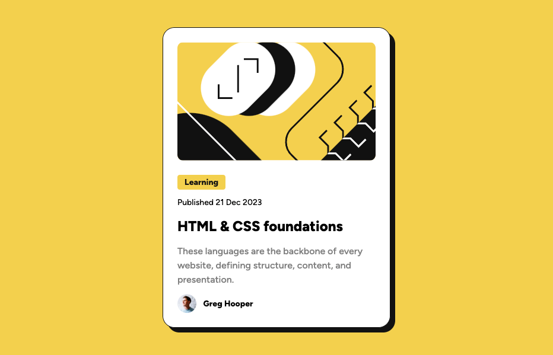

# Frontend Mentor - Blog preview card solution

This is a solution to the [Blog preview card challenge on Frontend Mentor](https://www.frontendmentor.io/challenges/blog-preview-card-ckPaj01IcS). Frontend Mentor challenges help you improve your coding skills by building realistic projects.

## Table of contents

- [Overview](#overview)
  - [The challenge](#the-challenge)
  - [Screenshot](#screenshot)
  - [Links](#links)
- [My process](#my-process)
  - [Built with](#built-with)
  - [What I learned](#what-i-learned)
  - [Continued development](#continued-development)
- [Author](#author)

## Overview

### The challenge

Recreating the Blog Preview Card presented in the challenge.

### Screenshot

### Links

- Solution URL: https://github.com/stefan-holmgren/fem-blog-preview-card
- Live Site URL: https://stefan-holmgren.github.io/fem-blog-preview-card/

## My process

### Built with

- Semantic HTML5 markup
- CSS custom properties
- Flexbox
- CSS Grid

### What I learned

Looking through the figma file and figuring out what to go where, and still trying to keep it as simple as possible was fun.

It's a very simple project and I'm looking forward to tackling the more complex ones.

### Continued development

Trying to learn more about CSS Grid and Flexbox, and how to use them together.

## Author

- Frontend Mentor - [@stefan-holmgren](https://www.frontendmentor.io/profile/stefan-holmgren)
